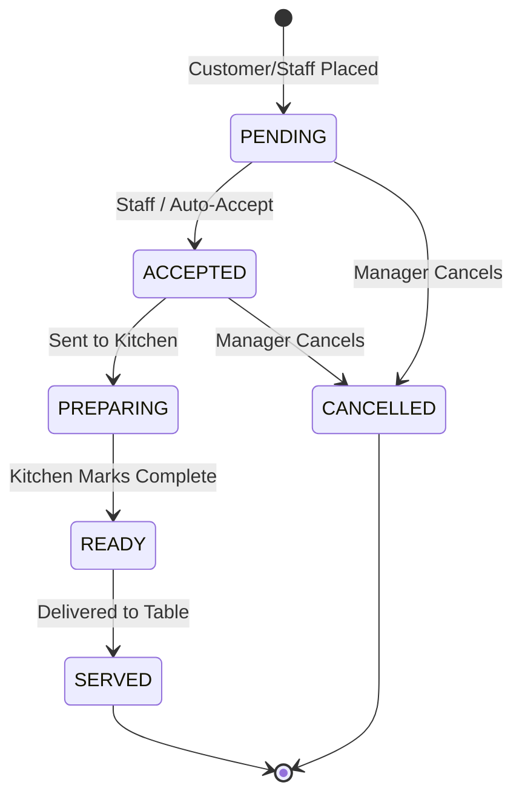

# Order Lifecycle Architecture (V2.1)

## 1. Domain Overview

The Scan Menu enforces complete domain separation:

```text
Physical Table (Permanent furniture & QR)
      ↓
Dining Session (Temporary visit lifecycle)
      ↓
Orders / Tickets (Immutable kitchen dispatches)
      ↓
Bill (Versioned financial invoice)
      ↓
Payments (Captured multi-tender transactions)
```

## 2. Order Immutability (No In-Place Merging)
- Every customer cart submission creates an independent, immutable `Order` ticket.
- In-place order mutation is completely eliminated.
- Each ticket has a monotonic `orderNumber` and an integer `roundNumber` (e.g. Round 1, Round 2).
- Items preserve point-in-time pricing snapshots (`unitPriceSnapshot`, `selectedAddOns`, `itemSubtotal`, `itemTax`, `itemTotal`).

## 3. Order Status State Machine



## 4. Integer Currency Standard
- All monetary figures are stored and calculated strictly as integers representing the smallest currency unit (paise for INR).
- Float rounding errors are completely eliminated.
